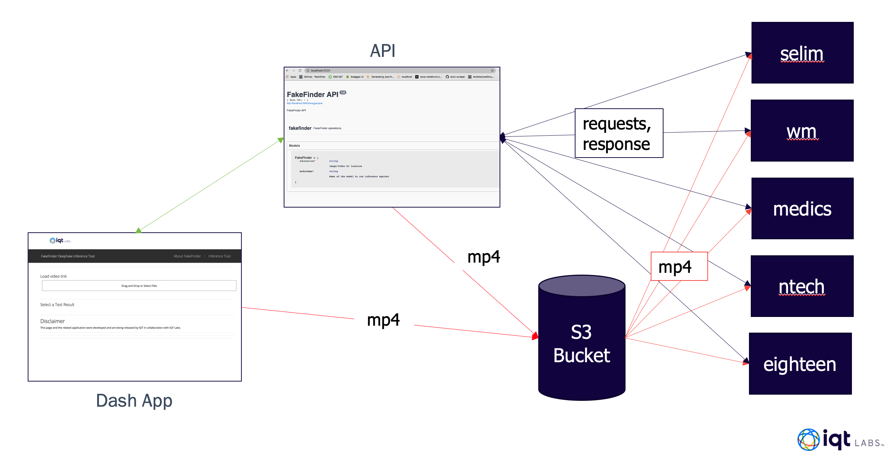
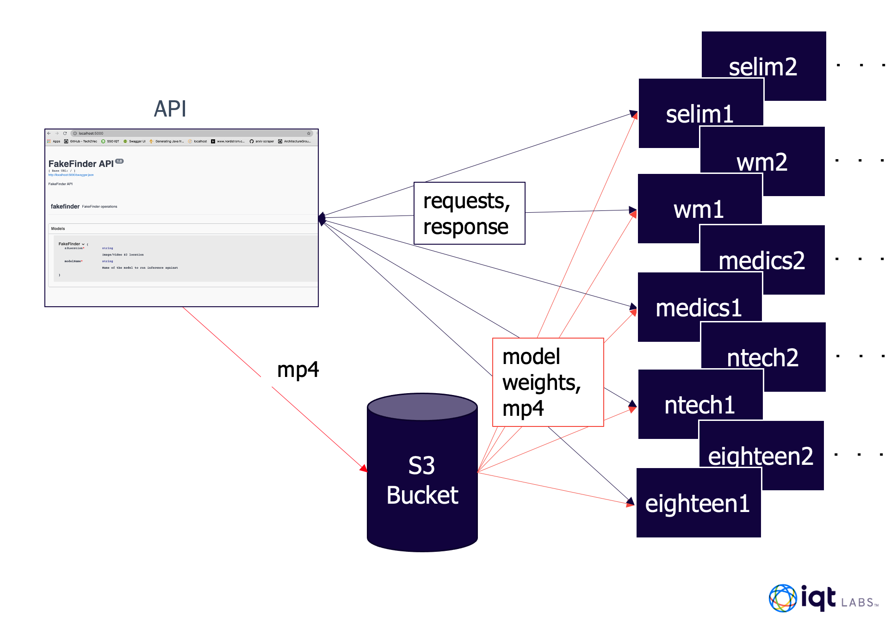
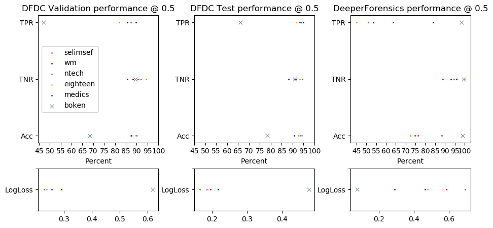
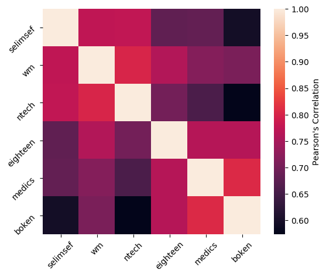

# FakeFinder: Sifting out deepfakes in the wild
The FakeFinder project builds upon the work done at IQT Labs in competing in the Facebook Deepfake Detection Challenge (DFDC).  FakeFinder builds a modular, scalable and extensible framework for evaluating various deepfake detection models. The toolkit provides a web application as well as API access for integration into existing media forensic workflow and applications. To illustrate the functionality in FakeFinder we have included implementations of six existing, open source Deepfake detectors as well as a [template] exemplifying how new algorithms can be easily added to the system.  

## Table of contents
1. [Overview](#overview)
2. [Available Detectors](#detectors)
3. [Isage Instruction](#usage)

## Overview <a name="overview"></a>

We have included [instructions] to reproduce the system as we have built it, using the [AWS] ecosystem (EC2, S3 and ECR).  The current tool accomodates two possible workflows:
### Small jobs: response time
The default behavior when using the Dash-App.  This work flow prioritizes availability by using **warm** (existing BUT stopped EC2 instances) or **hot** (existing AND running EC2 instances) virtual machines to run the inference on videos to be queried. 

### Large jobs: scalability
This is the default behavior when calling the system through the API and is intended for cases when a large amount of files need to be queried.  In this workflow you can specify the number of replicas of each worker and split the files to be tested between them.  This workflow leverages **cold** (don't currently exist) virtual machines.  Using pre-build images on a container registry we can scale the inference workflow to as many instances as is required, accelerating the number of files analyzed per second at the cost of a larger start-up time.


## Available Detectors <a name="detectors"></a>

Although designed for extensability, the current toolkit includes implementations for six detectors open sourced from the [DeepFake Detection CHallenge](https://www.kaggle.com/c/deepfake-detection-challenge)(DFDC) and the [DeeperForensics Challenge 2020](https://competitions.codalab.org/competitions/25228)(DFC).  
  The detectors included are:
  
| Name      | Input type | Challenge |
| ----------- | ----------- | ----------- |
| [selimsef](https://github.com/IQTLabs/FakeFinder/tree/main/detectors/selimsef)      | video (mp4)       |  DFDC<sup>1  |
| [wm](https://github.com/IQTLabs/FakeFinder/tree/main/detectors/wm)   | video (mp4)        |  DFDC<sup>1  |
| [ntech](https://github.com/IQTLabs/FakeFinder/tree/main/detectors/ntech)   | video (mp4)        |  DFDC<sup>1  |
| [eighteen](https://github.com/IQTLabs/FakeFinder/tree/main/detectors/eighteen)   | video (mp4)        |  DFDC<sup>1  |
| [medics](https://github.com/IQTLabs/FakeFinder/tree/main/detectors/medics)   | video (mp4)        |  DFDC<sup>1  |
| [boken](https://github.com/IQTLabs/FakeFinder/tree/main/detectors/boken)   | video (mp4)        |  DFC<sup>2  |

As part of the inplementation we have evaluated the current models against the test sets provided by both ([1](https://ai.facebook.com/datasets/dfdc/), [2](https://github.com/EndlessSora/DeeperForensics-1.0/tree/master/dataset)) competitions after they closed. The following figure shows the True Positive Rate (TPR), False Positive Rate (FPR) and final accuracy (Acc) for all six models against these data.  We have also included the average binary bross entropy (LogLoss) whcih was ultimately used to score the competition.



We have also measured the correclation between the six detectors over all of the evaulation dataset, shown in the following figure (Note: a correlation > 0.7 is considered a strong correlation)



## Usage Instructions <a name="usage"></a>

### Model Weights

Model weights are available in an s3 bucket named `ffweights` located in `us-east-1`.  To obtain the weights locally, install the [aws cli](https://docs.aws.amazon.com/cli/latest/userguide/install-cliv2.html) and run the following command:

```
aws s3 sync <path_to_weight_directory> s3://ffweights
```
This will create a top level directory called `weights`, with sub-directories for each detector.
### Docker Images

This repo contains Dockerfiles for the Dash App, API server, and each of the implemented detectors.  

To build images for each of the detectors, switch to the directory for the given detector and run the following command
```
docker build -t ${DETECTOR_NAME} .
``` 
where `DETECTOR_NAME` is the name of the detector (listed above).  By default, containers run from these images start a Flask app that serves the detector for inference.  To use GPUs in these containers you will need to install the [NVIDIA container toolkit](https://docs.nvidia.com/datacenter/cloud-native/container-toolkit/install-guide.html#docker), and utilize the NVIDA runtime when running the container:

```
docker run --runtime=nvidia -v <path_to_weight_directory>/weights/${DETECTOR_NAME}/:/workdir/weights  -d -p 5000:5000 ${DETECTOR_NAME}
```
### Configuring AWS EC2 instances and S3 Buckets