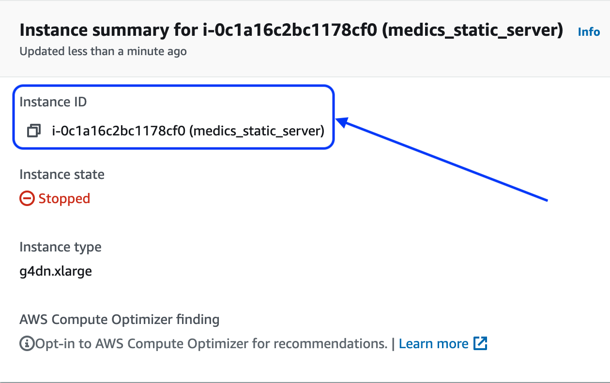

## Detector template
This directory includes the basic components used to incorporate a new detector into the system.  In general terms the procedure is as follows:
- Add the implementation for your specific detector and wrap it in the ensemble class.
- Build and test the docker image and container.
- Start a fresh virtual machine using the container you have built.  Stop the vm.
- Link the new virtual machine to the API.

The following section covers these steps in more detail.
### Adding a new detector

1. Create a new detector folder by copying [FakeFinder/detector/detector_template](https://github.com/IQTLabs/FakeFinder/tree/template/detectors/detector_template) to FakeFinder/detectors/<your_detector>. You will be working inside this directory:
```
cd detectors/<your_detector>
```
`<your_detector>` should be a short, single-word name for your detector (e.g. selimsef or ntech).

2. Implement the new detector in this directory.  Wrap it into an ensemble class using [Ensemble.py](https://github.com/IQTLabs/FakeFinder/blob/template/detectors/detector_template/ensemble.py).  The basic ensemble class includes two methods:
    1. The ```__init__``` method should initialize the model and load any necessary weights from the local weights directory.  Ideally this ensemble class should load all necessary weights, but this can occur in step 3 if so desired.
    2. The ```inference``` method will be called to make the predictions.  This method should expect to receive the path to a video, run the forensics pipeline for that algorithm, and return the score.  Currently we assigned the following labels:
        - 1: fake/manipualted 
        - 0: real.
3. Make any necesary changes to app.py.  This file will be used to initialize a flask application used by the service to respond to requests.
4. Generate a requirements file “requirements.txt” listing the packages and version required to recreate the environment used for the new detector.  For example you may use the pipreqs package: 
```
pip install pipreqs
pipreqs . 
```
5. Edit the [docker file](https://github.com/IQTLabs/FakeFinder/blob/template/detectors/detector_template/Dockerfile) with any additional steps needed to reproduce your working environment.  The template file we have included will:
    - Create a basic linux + python3 system
    - Install the packages in the requirements file
    - Expose port 5000 for external access to/from the API
    - Run app.py to start up the flask application
You can test the dockerfile build by replacing the last line:
```
CMD ["python3","app.py"]
```
with 
```
CMD ["/bin/bash"]
```
This will change the state of the docker container to provide a shell for experimentation instead of running the flask app.  Once the container has been tested return to the original:
```
CMD ["python3","app.py"]
```
You can also override the default `python3 app.py` command by running the container with the following command:
```
docker run -it --entrypoint=/bin/bash <your_image_name> -i
```
Test to make sure that an instance of the `ensemble` class performs inference without error, and that running `app.py` initializes an instance of `ensemble` withour error.

6. Push the code to your remote repository for use later.  Make sure that your weights are available on your EFS in the ./weights./<your_detector>/ directory so that it can be correctly mounted when running the container. 

7. Start up a virtual machine and mount the weights.  These instructions assume you are building the system in AWS using EC2 instances.  Once the machine is up and running make a local directory:
```
mkdir data
```
and then mount the drive (with ip address <drive_ip>) with the model weights to this data directory:
```
sudo mount -t nfs4 -o nfsvers=4.1,rsize=1048576,wsize=1048576,hard,timeo=600,retrans=2,noresvport <drive_ip>:/ /home/ubuntu/data
```
We need to make sure that the mounted drive persists over resets, using the following lines:
```
sudo chmod a+w /etc/fstab
echo "<drive_ip>:/ /home/ubuntu/data nfs nfsvers=4.1,rsize=1048576,wsize=1048576,hard,timeo=600,retrans=2,noresvport     0       0" >> /etc/fstab
sudo chmod a-w /etc/fstab
```
8. Clone the code to this vm instance using:
```
git clone <FakeFinder>
cd ./FakeFinder/detectors/<your_detector>
```
and build the associated docker image using:
```
docker build -t <your_detector>_i ./
```
9. Once the image has been build we will start a static virtual machine used when running the system in warm and hot modes. Initialize the docker container using:
```
docker run --runtime=nvidia --restart unless-stopped -v /home/ubuntu/data/weights/<your_detector>/:/workdir/weights  -d -p 5000:5000 <your_detector>_i
```
Once you have verified that the container has built correctly stop the EC2 instance until needed for inference.  Do not stop the container.  Make note of the instance id <instance_id>(shown below).  This will be used later to integrate with the API.



10. Log in to your Elastic Container Registry (ECR).  Tag your the docker image `<your_detector>_i`, following the push commands for your ECR, and push it to your registry.  This archived image will be used later when running batch inference to make as many copies of each worker as is requested to speed up inference.
11. To link the new detector to the api add the following line to the dictionary in [FakeFinder/api/models.json](https://github.com/IQTLabs/FakeFinder/blob/main/api/models.json):
```
<your_detector>:<instance_id>
```
and add the following to the dictionary in [FakeFinder/api/images.json](FakeFinder/api/images.json):
```
<your_detector>:<your_detector>_i
```
